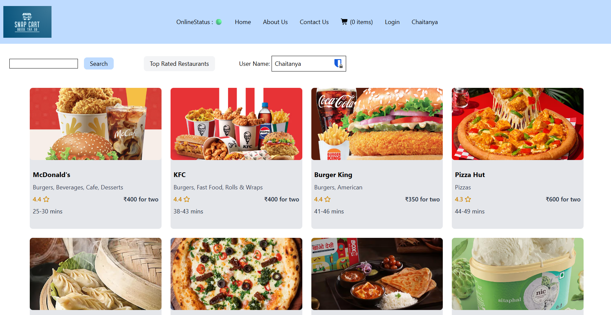
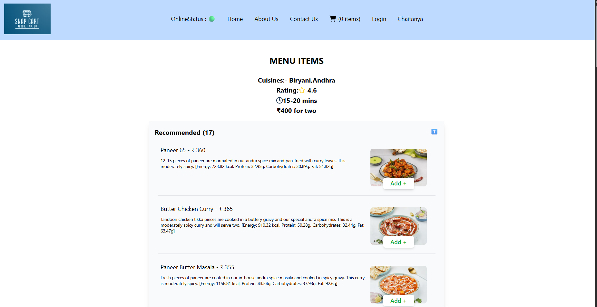

# 🍽️ Food Ordering App

A **React-based food ordering web application** that allows users to browse restaurants, view menus, and place orders seamlessly. The app is optimized for performance using **Parcel bundler**, **React Router**, **Redux Toolkit**, and **custom hooks**.

---

## 🚀 Live Demo

[Click here to view the app](https://your-netlify-link.netlify.app)

---

## 📌 Features

- ✅ Browse restaurant listings
- ✅ View detailed menus for each restaurant
- ✅ Add items to the cart and update quantities
- ✅ State management using **Redux Toolkit**
- ✅ Dynamic routing using **React Router**
- ✅ **Shimmer UI** for loading states
- ✅ **Lazy Loading** for optimized performance
- ✅ Responsive design with **Tailwind CSS**

---

## 🛠️ Tech Stack

- **Frontend**: React, React Router, Redux Toolkit
- **Styling**: Tailwind CSS
- **Bundler**: Parcel
- **State Management**: Redux Toolkit
- **Deployment**: Netlify

---

## 📂 Project Structure

```
├── src/
│   ├── components/
│   ├── pages/
│   ├── hooks/
│   ├── redux/
│   ├── utils/
├── public/
├── package.json
└── README.md
```

---

## ⚙️ Installation & Setup

```bash
# Clone the repository
git clone https://github.com/your-username/food-ordering-app.git

# Navigate to the project directory
cd food-ordering-app

# Install dependencies
npm install

# Start development server
npm start

# Build for production
npm run build
```

---

## 🔑 Environment Variables

Create a `.env` file in the root and add:

```
REACT_APP_API_URL=your_api_endpoint
```

---

## 🖼️ Screenshots




---

## 🔗 API Source

This project fetches data from [Swiggy Public API](https://www.swiggy.com) or mock data in `utils/mockData.js`.

---

## 🧰 Deployment

Deployed on **Netlify**:

- Build Command: `npm run build`
- Publish Directory: `dist`

---

## 🤝 Contributing

Pull requests are welcome! For major changes, please open an issue first to discuss what you’d like to change.

---

## 📜 License

This project is licensed under the **MIT License**.
